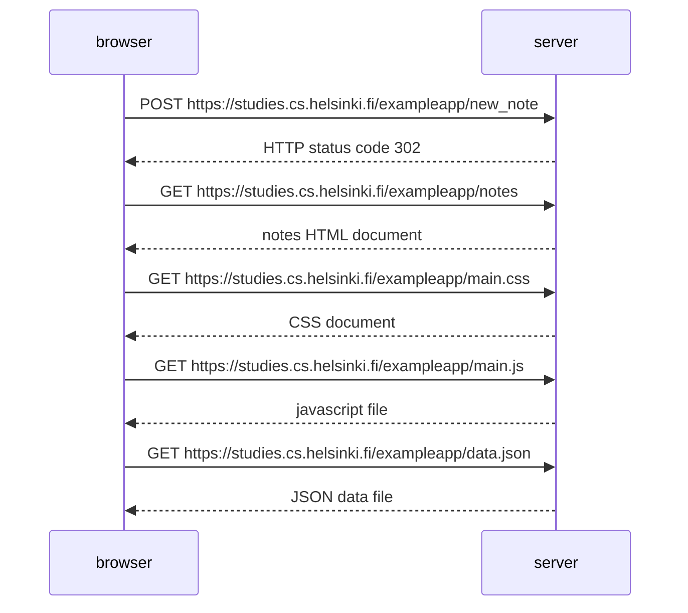

Sequence diagram exemple : 

```mermaid
sequenceDiagram
    participant browser
    participant server

    browser->>server: POST https://studies.cs.helsinki.fi/exampleapp/new_note
    server -->> browser: HTTP status code 302
    browser->>server: GET https://studies.cs.helsinki.fi/exampleapp/notes
    server-->>browser: notes HTML document
    browser->>server: GET https://studies.cs.helsinki.fi/exampleapp/main.css
    server-->>browser: CSS document
    browser->>server: GET https://studies.cs.helsinki.fi/exampleapp/main.js
    server-->>browser: javascript file
    browser->>server: GET https://studies.cs.helsinki.fi/exampleapp/data.json
    
    server-->>browser: JSON data file
    


```